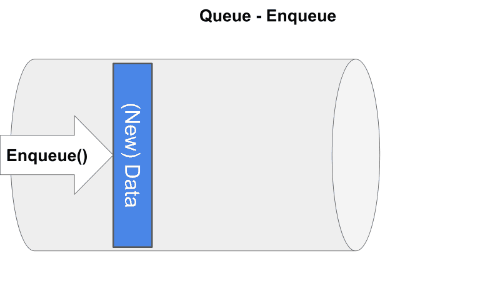
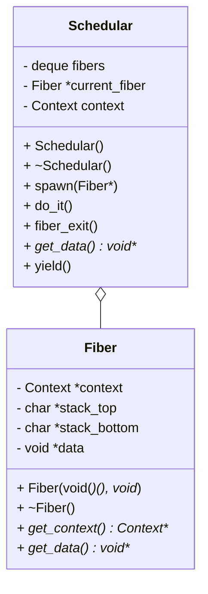
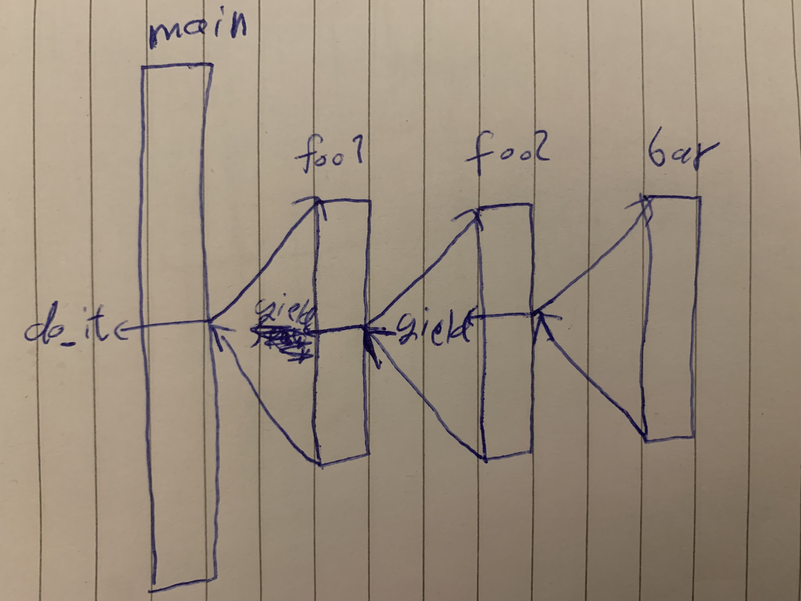
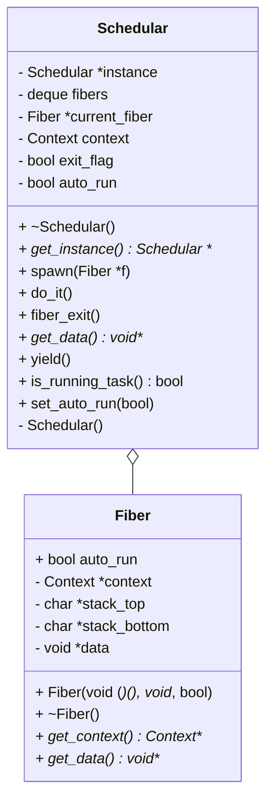
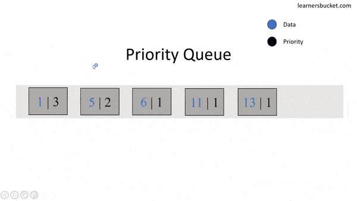
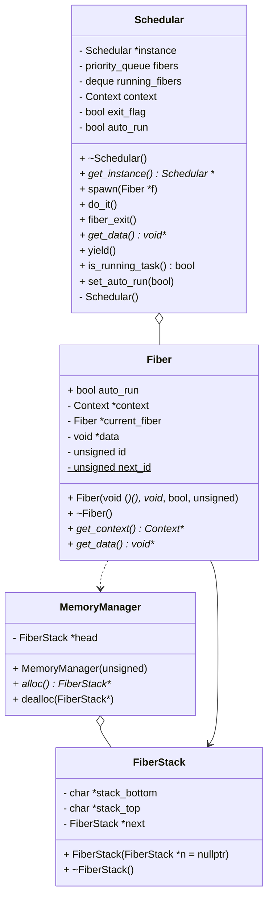

- [Introduction](#introduction)
  - [Cooperative scheduling](#cooperative-scheduling)
  - [How it is done](#how-it-is-done)
- [How to use](#how-to-use)
  - [Examples and unit tests](#examples-and-unit-tests)
  - [Use of the API](#use-of-the-api)
- [Task 1](#task-1)
  - [Example 1](#example-1)
  - [Example 2](#example-2)
  - [Example 3](#example-3)
  - [Example 4](#example-4)
- [Task 2](#task-2)
  - [`Fiber`](#-fiber-)
    - [Constructors](#constructors)
      - [`Fiber()`](#-fiber---)
      - [`Fiber(void (*function)(), void *data = nullptr)`](#-fiber-void---function-----void--data---nullptr--)
    - [Methods](#methods)
      - [`get_context()`](#-get-context---)
      - [`get_data()`](#-get-data---)
    - [Examples](#examples)
  - [`Scheduler`](#-scheduler-)
    - [Constructors](#constructors-1)
    - [Methods](#methods-1)
      - [`spawn(Fiber)`](#-spawn-fiber--)
      - [`do_it()`](#-do-it---)
      - [`fiber_exit()`](#-fiber-exit---)
      - [`get_data()`](#-get-data----1)
    - [Examples](#examples-1)
  - [`Fibers` API](#-fibers--api)
    - [Examples](#examples-2)
  - [Class diagram](#class-diagram)
- [Task 3](#task-3)
  - [changes](#changes)
    - [Singleton](#singleton)
    - [manual execution of tasks](#manual-execution-of-tasks)
      - [exit flag](#exit-flag)
      - [scheduler auto run flag](#scheduler-auto-run-flag)
      - [fiber auto run flag](#fiber-auto-run-flag)
    - [running fibers stack](#running-fibers-stack)
    - [`get_data()`](#-get-data----2)
  - [`yield()`](#-yield---)
  - [Example](#example)
  - [Class diagram](#class-diagram-1)
- [Extra features](#extra-features)
  - [free list](#free-list)
    - [Implementation](#implementation)
      - [`FiberStack`](#-fiberstack-)
      - [`MemoryManager`](#-memorymanager-)
    - [`Fiber` changes](#-fiber--changes)
  - [priority queue](#priority-queue)
    - [`Scheduler` changes](#-scheduler--changes)
    - [`Fiber` changes](#-fiber--changes-1)
  - [Examples](#examples-3)
    - [1](#1)
    - [2](#2)
    - [3](#3)
  - [Class diagram](#class-diagram-2)
- [Unit tests](#unit-tests)

<small><i><a href='http://ecotrust-canada.github.io/markdown-toc/'>Table of contents generated with markdown-toc</a></i></small>

# Introduction

## Cooperative scheduling

Cooperative scheduling involves the concept of fibers yielding to one another. These fibers efficiently transfer the responsibility of context switching from kernel-space to user-space, allowing the fibers themselves to perform these switches. The advantage of this approach lies in the potential elimination of a significant portion of multiprocessing overhead while still accommodating an abundance of execution threads, now in the form of these fibers. Consequently, this setup prevents the possibility of data races or deadlocks.

## How it is done

We will do it the same way Lua coroutines operate and async/await is done in JavaScript and Python using the N:1 model, utilizing the main thread provided by the operating system for the main function. This main thread will be shared among all tasks (fibers) and managed by the scheduler, and the fibers body will have yields to move execution to others when necessary

# How to use

first you need to clone the repository locally with the following command:

```bash
$ git clone --recurse-submodules https://gitlab.uwe.ac.uk/y2-abuhummos/assignment.git
$ cd worksheet-2
```

each of the tasks' source code can be found in the [`include`](./include/) directory and examples and unit tests are provided for each task in [`examples`](./examples/) and [`unit-tests`](./unit-tests/)

## Examples and unit tests

A `Makefile` is provided to make it easier to run the examples and unit tests, the following command is to run the examples:

```bash
$ make example TASK=<task number> MAIN=<example number>
```

and this is to run the unit tests:

```bash
$ make unit_test TASK=<task number>
```

where `<task number>` is 1, 2, 3 or extra for the new features and `<example number>` is the number of the file in the examples directory

## Use of the API

In order to be able to use the fibers api in your own code, the easier way is to include it in your path using:

```bash
$ export CPLUS_INCLUDE_PATH="${CPLUS_INCLUDE_PATH:+${CPLUS_INCLUDE_PATH}:}/path/to/repo/include"
```

and then you can use it in your cpp code as follows:

```cpp
#include <task-3/fibers.hpp>

void f(){
    // do stuff here
    fiber_exit();
}

int main() {
    spawn(f);
    do_it();
}
```

and you will need to include the cpp files in your compilation: (note we will assume you are working in this directory to simplify the command)

```bash
$ clang++ -o main your_file.cpp include/task-3/fibers.cpp /include/task-3/scheduler.cpp /include/task-3/fiber.cpp /include/context/context.s
```

# Task 1

This task does not have any fibers or an actual scheduler, what is does is set some starting blocks for the logic behind them, and in this section we will go through the files in [`examples/task-1`](./examples/task-1/)

## Example 1

This example illustrates the basic concept of context switching. Initially, it creates a global context as a checkpoint to store the instruction pointer, stack, and necessary registers. then sets the context back to that checkpoint while `x` is less than 5.

Key takeaways:

- the global context serves as a checkpoint for all fibers. So when a fiber completes its execution it switches back to the global context.

## Example 2

Now for this example, we move out of `main` into other functions. First, a stack that will be used by the function is created and aligned with the architecture requirements. The function pointer, which acts as the next instruction, and stack pointer are then set in a `Context` object. Upon switching the context, control is transferred to the function specified by the function pointer, in this case, `foo`.

We require custom stacks for fibers to preserve local variables and objects during context switches, as local variables' contents must be retained across fiber switches. Additionally, destructors rely on stack objects that gets destroyed upon function return.

Key takeaways:

- the body of the `main` function serves as the constructor for fibers.

## Example 3

Here we combine what we learnt from examples 1 and 2 to be able to call multiple functions.

First thing we can see is the use of a global context `main_context` which is used by all the functions, with a first use in `main` to create the checkpoint we mentioned before. In addition to that, the stack set up has been extracted into its own function since its used for all functions

Each function ends with setting the context back to the checkpoint using the global context, just like we used to jump backwards in example 1

Key takeaways:

- `main` is working like a task manager (aka scheduler)

- `set_context(main)` acts as a `fiber_exit` so we can go back to the manager of tasks

## Example 4

This example does the same thing as 3, but in a different way, instead of having to set a checkpoint that all functions can access it uses `swap_context` which effectively does both storing the main context and setting the function's one. In other words, `main` is yielding control to other functions

Key takeaways:

- the `swap_context` is the base for `yield`.

- if we make all the contexts global, we can `yield` from any function to another, but instead of calling set_context(main) at the end we will need to know the yield-er, which is the scheduler's job

# Task 2

This is where we start working with fibers and a scheduler, by building on top of the findings of examples 1-3.

## `Fiber`

The `Fiber` class simply extracts what was done in Task 1 example 2.

### Constructors

#### `Fiber()`

default constructor is deleted, as there is no point of creating a fiber without a function.

#### `Fiber(void (*function)(), void *data = nullptr)`

this overloaded constructor takes in a pointer to the function that the fiber will run and a c-style generic pointer to the data that the function might need, otherwise it defaults to null.

in the body, it creates the stack, aligns it, and then creates a context and assigns it the top of the stack and the function pointer

Worth noting that the fiber keeps track of the bottom of the stack for the purpose of freeing up the memory once the fiber has finished runnings, so any data that was created on the stack when it ran can be destructed, as mentioned before

### Methods

#### `get_context()`

returns the context to be used by the scheduler to move control to that fiber

it could have been replaced by a method to encapsulate around the context, and do `set_context` (even `swap_context` since we would pass in the same type) internally, but this has been chosen for separation of concerns, because the scheduler is the one responsible for switching contexts

#### `get_data()`

returns the data pointer stored in for the use of the function.

Note that, there was attempts to store the data within the fields of the `Context` object, like on the stack or in one of the registers, but unforunately that was not possible as everything gets overwritten with a call to `set_context`

### Examples

example 1 demonestrates how fibers can be used on thier own and managed by `main`, though we are still using integers to determine which `fiber` to call next.

This is where the `Scheduler` comes in palce.

## `Scheduler`

The scheduler manages fibers in a more systematic way, instead of having random parts of the code do stuff on thier own.

As we saw in all the previous examples, the first tasks that get created, get executed first, which is also know as fist in first out system (FIFO), thus the internal data structure that will be used to store and manage fibers in our scheduler is a **queue**.



source: https://javascript.plainenglish.io/data-structures-in-javascript-28ce180b7673

In addition to the queue field theres 2 other fields in the class, one that stores a context for the scheduler that gets used upon exit, which is the same as the global context we've been using. and another that stores the currently running fiber, so it can be used when the fiber data is requested

### Constructors

Theres only the default constructor and all it does is initialize the queue and the "global" context for the scheduler

### Methods

#### `spawn(Fiber)`

this method has to be called first, as it is the one that pushes fiber onto the queue, and note that the order at which you push tasks matters, as they will be executed in the same order

#### `do_it()`

once the user has spawned all the tasks they want, they need to call `do_it` in order for them to start executing

First thing in the function is calling `get_context` on the scheduler's context so that we can get back here once execution of the fiber finishes, then it pops off the queue sets the context to the fiber's so control goes to the function

what it is effectively doing is simulate a `swap_context` just like example 4 of task 1. It is also creating a loop with `fiber_exit` as we will see in the next section, and this for loop won't finish until all tasks are executed

#### `fiber_exit()`

this method must be called at the end of every function for it to be able to exit, and give control back to the scheduler, internally all it does is set the context back to the scheduler's context.

Now if we combine it with what we did in `do_it` we can notice there is a while loop, every iteration starts with the `get_context` in `do_it` and ends with the `set_context` in `fiber_exit` and the terminating condition is the if statement in `do_it`

#### `get_data()`

this is simply used inside of a task to use the data associated with that fiber, and to retrieve it, the scheduler uses the field specified for the currently running fiber

### Examples

example 2 shows a basic usage of the scheduler. and yet again, the scheduler has to be global for functions to be able to exit, the example shows the useage of all the methods, it first `spawn`s 2 tasks, and passes the same pointer to them, then calls `do_it` to start execution, and if you look in the output the print statements of the functions are in the same order as they where spawned because we are using a FIFO data structure

then inside each of the function we can see them accessing their associated data with `get_data`, modifying it and finally exiting with `fiber_exit`

---

We have a working scheduler now, but an annoying thing is that the user will need to create a global instance to be able to use the library, which might be inconvenient for some. The next section will look at a solution for this issue

## `Fibers` API

What we can do to eliminate the global scheduler on the user's side is to encapsulate the scheduler with our own functions, thats what the `fibers.cpp` file does.

The file creates its own global instance, and has the methods of the class, just in a function form, then these call into the instance's methods.

The only fucntion that has a differnce is the `spawn` one, as it takes the function pointer and data, and creates the fiber itself, rather than having the user deal with fibers

### Examples

Example 3 is pretty much the same as 2, just simplified by taking out the ugly bits, we can see all calls are to functions, and there is no global variable that the user has to deal with

## Class diagram



# Task 3

So far the functions we spawn keep executing until they finish, but this lacks the term "cooperative", unlike what we discussed in the intro. In order to have cooperative behaviour we will need a new functionality `yield` which allows other functions to execute in the middle of a function's execution

Before we start explaining `yield`, the `Scheduler` and `Fiber` classes have had some changes to accommodate for yield and some general quality of life improvements. we will go through the changes first then go into `yield`.

## changes

### Singleton

the biggest change is that the `scheduler` now doesnt need a global instance, as it has become a singleton, and thus the changes that occured are making the constructor private, and making the methods static so they can be accessed directly with no need for creating an instance

### manual execution of tasks

It made sence to offer a new mode of execution for the user, so instead of only calling `do_it` once, there is a mode for manual execution, so lets say the user spawns 3 tasks, they have to call `do_it` 3 times.

#### exit flag

This change required a new flag to be added to the scheduler, since there is a running loop between `do_it` and `fiber_exit`, the flag is used at the top of the `do_it` loop, if its on it will exit and turn it off, and its only turned on inside the `fiber_exit` method

#### scheduler auto run flag

since it is an optional mode, there needs to be a flag in the scheduler that decides if its on or off, and can be toggled with 2 new methods in the `fibers` api being:

- `auto_run` for the normal mode
- `manual_run` for the normal mode

#### fiber auto run flag

In addition to the flag in the scheduler there is another flag in the fiber, because the specs require that any fiber that gets spawned from inside a fiber has to be executed the moment its reached, thus we need to set a flag for those that get spawned while fibers are running

this also required a new method inside the scheduler to check if there is running tasks called `is_running_task`

### `get_data()`

the function was made a template in the API so the user does not have to deal with pointer casting

## `yield()`

the implemntation of yield is very similar to that of `do_it`, the only difference is that we do not need to create a checkpoint to come back to as we did with the scheduler's context. for it we use `swap_context` which takes 2 contexts, one is the one already running and the other is reclaimed off the queue, then they get swapped

## Example

example 1 and 2 show how `yield` works, we also have a nested yield. the best way to show it is using a drawing:



and to look at it from the perspective of the queue:

```
spawned all three
    fibers: ['foo1', 'foo2', 'bar']
    running: nullptr

do_it: main -> foo1
    fibers: ['foo2', 'bar']
    running: 'foo1'

yield: foo1 -> foo2
    fibers: ['bar', 'foo1']
    running: 'foo2'

yield: foo2 -> bar
    fibers: ['foo1', 'foo2']
    running: 'bar'

fiber_exit: bar -> foo1
    fibers: ['foo2']
    running: 'foo1'

fiber_exit: foo1 -> foo2
    fibers: []
    running: 'foo2'

fiber_exit: foo1 -> main
    fibers: []
    running: nullptr
```

(note we are using foo1 and foo2 for clarity)

## Class diagram



# Extra features

additional features have been researched and implemented in a new file to leave the original files clean

## free list

to optimize the fiber implementation, the `new` general-purpose allocators was replaced with a freelist allocator. The rationale behind this shift lies in the inherent inefficiency of using it for allocating fiber stacks, given their relatively slow performance.

By using an upfront allocation of stacks coupled in a freelist. This is because a freelist provides the most recently deallocated stack upon allocation. This feature is particularly advantageous for caching purposes.

For instance, when fiber B reuses the stack allocation from a just-completed fiber A, the freelist eliminates the necessity to reach out to system memory to allocate a stack, instead it will just retrieve a cached one.

### Implementation

It is simply done using a linked list, with each node storing the stack bottom and top and the pointer to the next node. Then there is a manager that tracks th

#### `FiberStack`

This structure is the nodes of the linked list, and has fields to store stack bottom and top and the next node in the list.

#### `MemoryManager`

This is the actual linked list, it has one field only to keep a reference to the head. It has two methods, an overloaded constructor and a destructor:

- `MemoryManager(unsigned s)`: allocates `s` many stacks in a linked list fashion

- `alloc()`: which returns the head, and if the list is empty it creates a new one

- `dealloc(FiberStack)`: takes back the node pointer and makes it the head

- Destructor: deallocates all the stacks

### `Fiber` changes

now the constructor does not create a stack rather it requestes one from the manager and gives the top of it to the context. Upon destruction, it gives back the node to the manager

## priority queue

the scheduler's implementation replaced the queue data structure with a priority queue, to for a more flexible scheduling mechanism. The priority queue allows tasks to be organized based on their priority levels, enabling the scheduler to execute higher-priority tasks before lower-priority ones.



source: https://learnersbucket.com/tutorials/data-structures/priority-queue-implementation-in-javascript/

This adjustment proves particularly beneficial in scenarios where certain tasks require immediate attention or have dependencies. For example, in a real-time system handling both user interface updates and background processing, the priority queue ensures that UI-related tasks take precedence over less time-sensitive background tasks.

### `Scheduler` changes

The obvious change is that the fibers queue was replaced with a priority queue

### `Fiber` changes

- A new `priority` field is added, which resembles the desides its priority in the scheduler

- A new `id` field, it was need due to weak-ordering nature of the `priority_queue` data structure of the standard library. thus this field is used in the case of 2 fibers having the same priority, the one with the lower `id` takes precedence since its a FIFO system

- a comparison operator is implemented for the class, as it is needed by the data structure internal implementation to decide the order

- a comparison class `CompareFiber` is made with an overloaded `operator()` which takes 2 `Fiber` pointers, it is needed because we store pointers to fibers in the queue, and the comparison between them would return the greater of the 2 pointers

## Examples

### 1

The example shows how the priority queue works and sorts tasks, this is how they would look before execution:

```
    spawn(f4, nullptr, 4);
    spawn(f2, nullptr, 3);
    spawn(f1, nullptr, 3);
    spawn(f3, nullptr, 2);
    spawn(f1, nullptr, 1);
    spawn(f4, nullptr, 1);
```

### 2

Here it shows how the priority would act as a normal queue if all of the tasks where of the same priority

### 3

this one is about the freelist, and that it wouldnt crash with allocations more than the original

## Class diagram



# Unit tests

There is 34 unique unit tests for the tasks that cover a wide range of combinations, in order to test if the fibers are run in the correct order and timings, each test is run twice once with an int and different math operations are applied on it. and in the test case we check for order of operations. the second run is with a string and functions append characters to it, then in the test case we check if the sequence is correct
