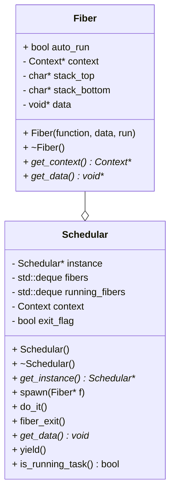

```mermaid
classDiagram
    class Fiber {
        + Fiber(function, data, run)
        + ~Fiber()
        + get_context() Context**
        + get_data() void**

        + bool auto_run
        - Context* context
        - char* stack_top
        - char* stack_bottom
        - void* data
    }

    class Schedular {
        + Schedular()
        + ~Schedular()
        + get_instance() Schedular* *
        + spawn(Fiber* f)
        + do_it()
        + fiber_exit()
        + get_data() void*
        + yield()
        + is_running_task() bool

        - Schedular* instance
        - std::deque<Fiber*> fibers
        - std::deque<Fiber*> running_fibers
        - Context context
        - bool exit_flag
    }

    Fiber --o Schedular
```
